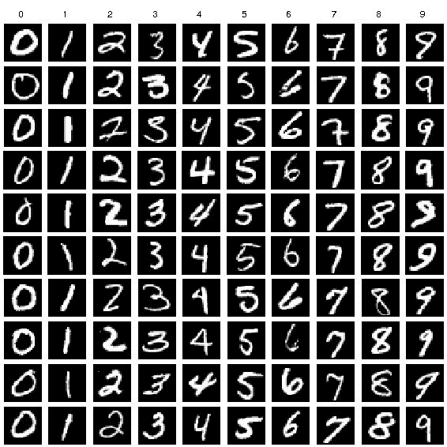
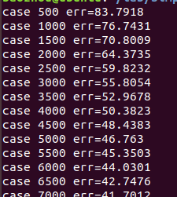
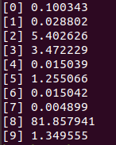

# Advanced Computing Systems 2020-2021 Lab 3 – Convolutional Neural Networks (CNNs)

This application is intended to help students understand GPU programming through the acceleration of Convolutional 
Neural Networks (CNNs), which is based on the implementation [simple_cnn](https://github.com/can1357/simple_cnn) by 
[can1357](https://github.com/can1357).
This repository contains all files and explanation needed to perform the  third lab of the
EE4C07 - Advanced Computing Systems course at the  Delft University of Technology.

## What do I have to do for Lab 3?

Quick version:

* Download the baseline project.
* Implement the convolution layer and fully connected layer of CNNs using only CUDA, specifically including the
  activate, fix_weights and calc_grads functions. (You cannot use any CUDA-Accelerated Libraries or other external
  libraries, only pure CUDA / C / C++)
* Optimize the training process as much as you can.
* Write a report.
* Turn in your report.
* Rejoice with the knowledge that you have gained.

## What are these files in the project?

* The files in the src/ directory represent the baseline project, which provides the architecture of a CNN to be
  trained on the MNIST dataset.
* The files in the src/cnn directory define all tensors, the layers, the gradient calculation and optimization method 
  of CNNs.
* The files “train-labels.idx1-ubyte” and “train-images.idx3-ubyte” are the training images and labels of MNIST, 
  provided to train the CNN. The file “test.ppm” is a test image of MNIST supplied for the inference of the CNN after 
  it gets trained.

## What does the baseline project do?

There are two parts in the baseline project. One performs the training stage of the CNN on the MNIST dataset, and 
another performs the inference stage using the trained CNN. Below, we will first describe the definition of tensors 
in CNNs, since tensors represent the basic data type in deep neural networks. Then, the input dataset, the 
architecture, the training and inference of CNNs in the Baseline directory are discussed.

#### 1. The tensor data type

Most of the variables in deep neural networks are represented as tensors. A tensor is a multidimensional 
array, in our CNN tensor are either two or four dimensional arrays. Taking the input tensor as an example, it 
can be represented as input[N, C, H, W], where the dimensions correspond to the batch size (N), the number of 
input channels (C), the height (H) and width (W) of the image.

#### 2. The input dataset

The input dataset to train our CNN is MNIST, which is one of the most well know datasets in the machine learning 
filed. The MNIST dataset contains images of handwritten digits (“0” to “9”), with a training set of 60k examples,
 and a test set of 10k examples. The training images and training labels are located in the main project directory.

* For the training images, the handwritten digits have been normalized and centered in a fixed-size image. Below 
are some samples from the training dataset, which represent samples from all digits ranging from “0” to “9”.


 
* For the training labels, each training label is on-hot encoded in a sparse vector, where the position of the “1” 
entry in the vector corresponds to the digit value on the training images.

#### 3. The architecture of the CNN

The CNN in this project is composed of four layers that are typically used in deep neural networks. The 
topology of these layers is as follows.

```
conv_layer_t( ... );	// convolution layer		
relu_layer_t( ... );  // non-linear layer       
pool_layer_t( ... );	// pooling layer			
fc_layer_t( ... );	// fully connected layer				
```

#### 4. Training of our CNN

Each of the training images is trained once, which is called one epoch. The files in the Baseline directory will 
run the training process for one epoch. This will result in a decreasing error down to about 20%, which will be printed
every 6000 training images.


 
5. CNN inference process

Inference involves only computing the forward pass in the CNN. One image with the digit “8” is provided to test 
the trained CNN; its inference output is shown below. The output lists the probability the image corresponding 
to each of the digits from “0” to “9” as computed by the CNN. The digit with the maximum probability is the 
inferred result. 


 
## What should I do with the baseline project?

* You should read the baseline source code and figure out how the program works.
* You are expected to accelerate functions in two of the four CNN layers: 
1. the convolution layers and 
2. the fully connected layer.

* In these two layers, you should use CUDA to accelerate at least following three functions: 
1. the activate (i.e., forward pass), 
2. calc_grads (i.e., backward pass) and 
3. fix_weight (i.e., update weights)

* Most of the data in CNNs is expressed using tensors, which facilitate the speed up of the training and 
inference process, which can help accelerating other parts of the CNN. Therefore, you are also encouraged to
 accelerate the pooling layer, the non-linear (relu_layer_t) layer, and even the reading function of input 
 images, to further improve the performance.

##What will we run to test if you’ve implemented everything correctly?

* The function correctness of the training will be checked.

One epoch of the training will be run to see whether the training of the CNN works, and the error should start 
to decrease from 83±1 to 20±1. You need to ensure that this change happens as fast as possible.

* The training time will be measured for speedup.

For the convolution and fully connected layers, the implementation using CUDA is the essential part. Since you 
are encouraged to accelerate all the layers, the larger the speedup you get, the better your work will be evaluated.

## Can I share some of my knowledge with people outside my group?

There are some bonus points awarded to the groups with the fastest implementation.

You can decide whether sharing your industry secrets on optimizations of this 
algorithm with other groups is a smart thing to do ;-)

* 1st place: +15% on lab 3 grade
* 2nd place: +10% on lab 3 grade
* 3rd place: +5% on lab 3 grade

## How can I gain more knowledge about CNNs?

* Here are some official websites of famous deep learning frameworks, where tutorials are easy to follow.
https://www.tensorflow.org/
http://caffe.berkeleyvision.org/
https://pytorch.org/

* To gain more theory about CNNs, here is one open source course to help you.
http://cs231n.stanford.edu/

## Can I change the architecture of the CNN in the Baseline directory?

You can do so, but it should not be necessary and it is not encouraged. For the purpose of this lab, you are evaluated 
on your knowledge of computer engineering, not machine learning.
If you change the architecture, both the function and performance are still maintained or enhanced, which will also 
be considered for sure as qualified submission.

## Can I fork this repository as a student?

Answer: __NO, DO NOT FORK IT (publicly)__. 
See the Lab 1 statement about this.

## Is there a template for the lab report?

You can use the templates from Lab 1 and Lab 2, and modify them according to what
you want to convey through your report. However, these things MUST be included in
the discussion of your report:

1. An application profile of the baseline / intermediate versions.
2. An estimation on what performance can be gained after improving specific parts, 
  based on the profiles.
3. A short discussion on how you've improved specific parts.
4. Go back to 1 and repeat until you've squeezed out as much throughput as possible.

Other than that we will use exactly the same rubric as supplied in Lab 1 to grade the
lab work and report. So make sure you convey the information needed for the lab instructors
to base a grade on.
